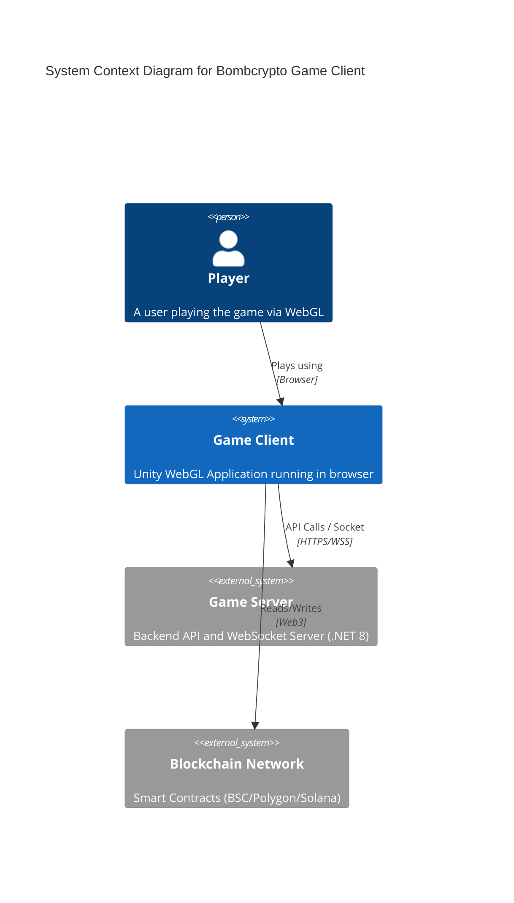
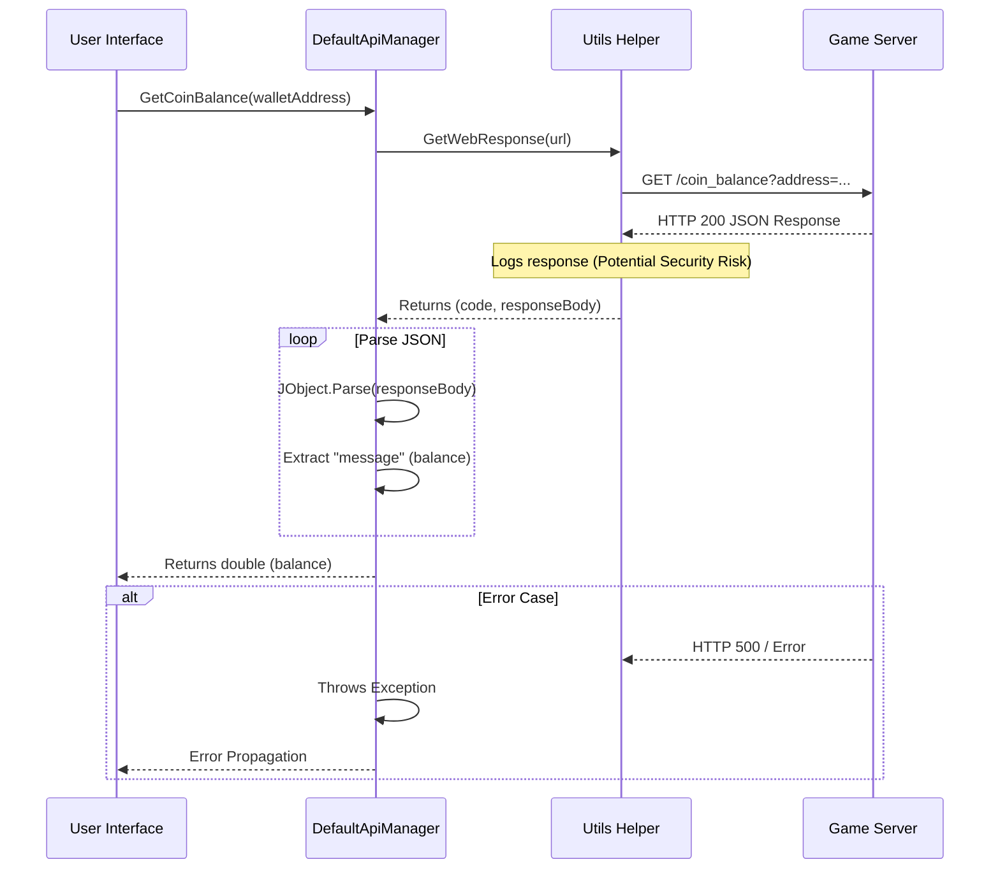
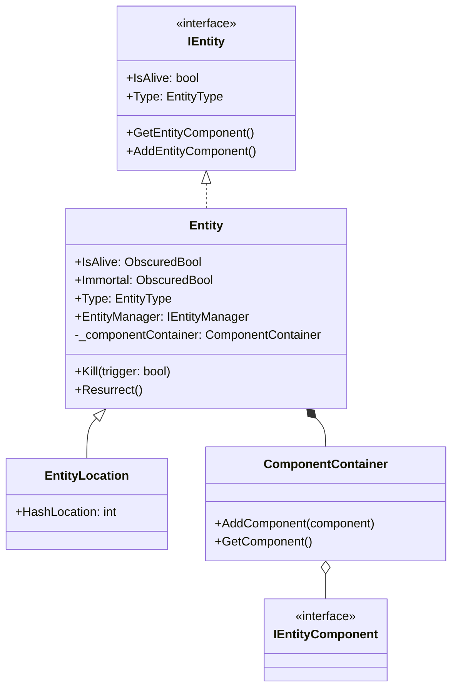

# Architecture: Bombcrypto Game Client

## 1. Context Diagram (C4 Level 1)
This diagram illustrates the high-level relationship between the user, the client, and the external systems.



## 2. Sequence Diagram: Get Coin Balance
This sequence details the flow when the client requests the user's balance.



## 3. Class Diagram: Entity Component System (ECS) Lite
The core game engine uses a lightweight ECS pattern involving `Entity` and `ComponentContainer`.



## 4. Folder Structure Analysis
The `Assets/Scripts` directory is organized by domain and layer.

```text
Assets/Scripts/
├── Engine/          # Core Game Logic (ECS, Physics, Managers)
│   ├── Entities/    # Base Entity classes (Entity.cs, Bomb.cs)
│   ├── Component/   # Logic Components attached to Entities
│   └── Manager/     # Game State Managers
├── Services/        # External Communication & Data Services
│   ├── DefaultApiManager.cs  # REST API Handler
│   ├── Utils.cs              # Helper Functions
│   └── ...                   # Specific Feature Managers (Shop, Inventory)
├── Data/            # Data Containers & ScriptableObjects
├── UI/              # User Interface Scripts
└── Utils/           # General Purpose Utilities
```
