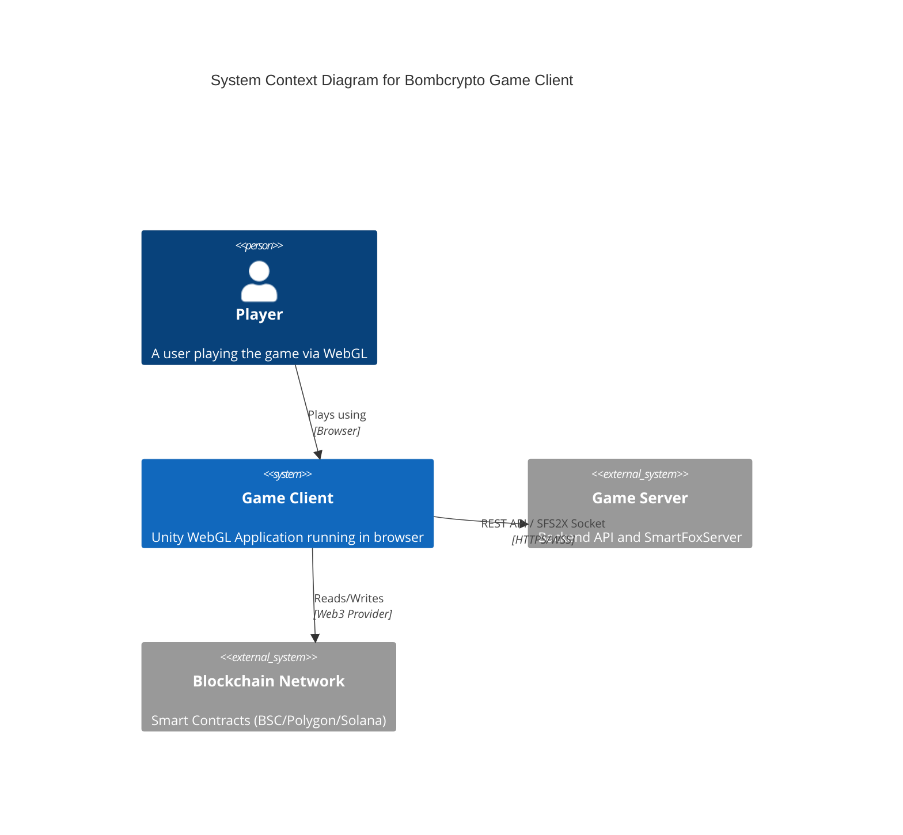
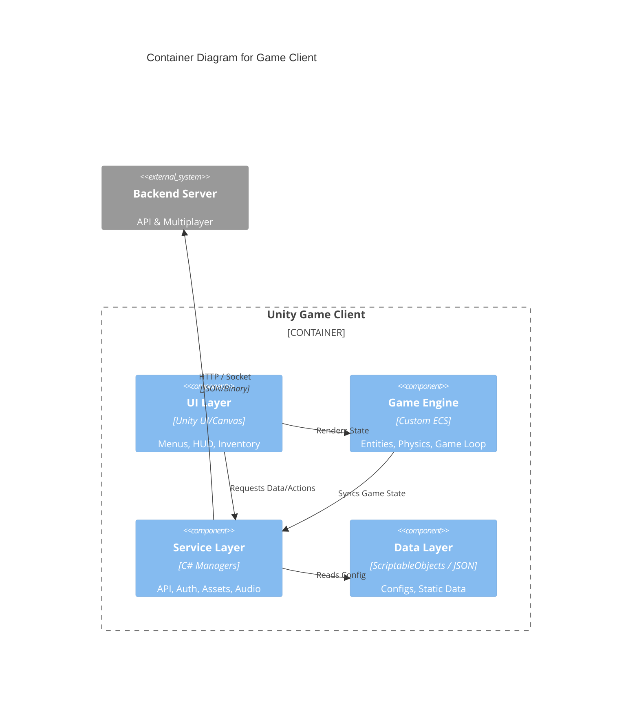
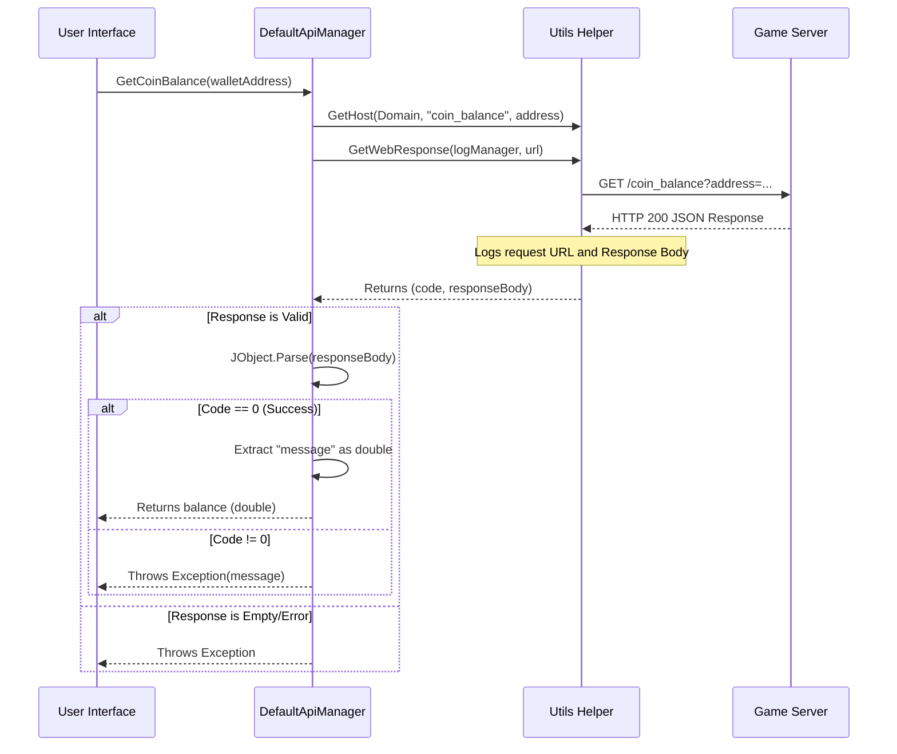
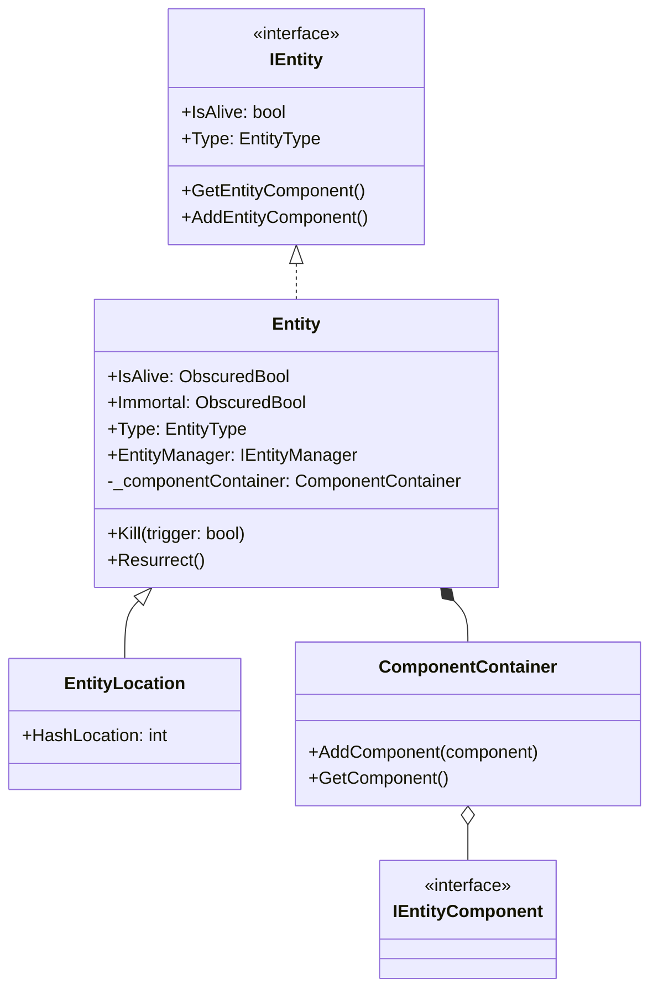

# Architecture: Bombcrypto Game Client

## 1. Context Diagram (C4 Level 1)
High-level relationship between the user, the client, and external systems.



## 2. Container Diagram (C4 Level 2)
Internal structure of the Game Client application.



## 3. Sequence Diagram: Get Coin Balance
Detailed flow for retrieving wallet balance via `DefaultApiManager`.



## 4. Class Diagram: Entity Component System (ECS) Lite
The core game engine uses a lightweight ECS pattern involving `Entity` and `ComponentContainer`.



## 5. Folder Structure Analysis
The `Assets/Scripts` directory is organized by domain and layer.

```text
Assets/Scripts/
├── Engine/          # Core Game Logic (ECS, Physics, Managers)
│   ├── Entities/    # Base Entity classes (Entity.cs, Bomb.cs)
│   ├── Component/   # Logic Components attached to Entities
│   └── Manager/     # Game State Managers
├── Services/        # External Communication & Data Services
│   ├── DefaultApiManager.cs  # REST API Handler
│   ├── Utils.cs              # Helper Functions (Networking, Logging)
│   └── Server/               # Server Bridge Interfaces
├── Data/            # Data Containers & ScriptableObjects
├── Config/          # Configuration Classes (AppConfig.cs)
├── UI/              # User Interface Scripts
└── Utils/           # General Purpose Utilities
```
