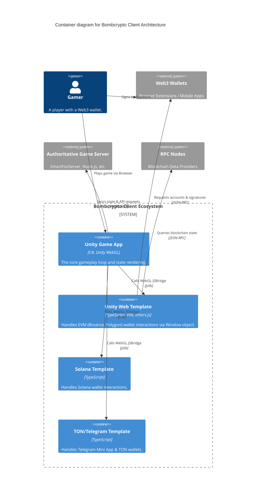
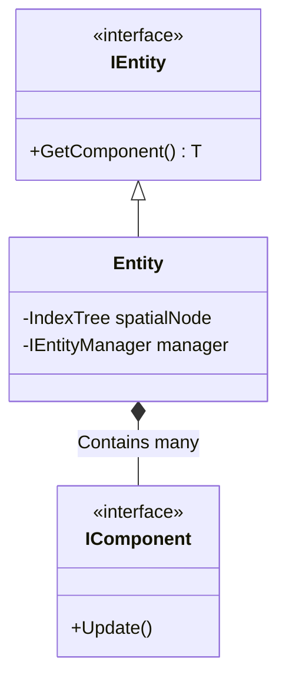
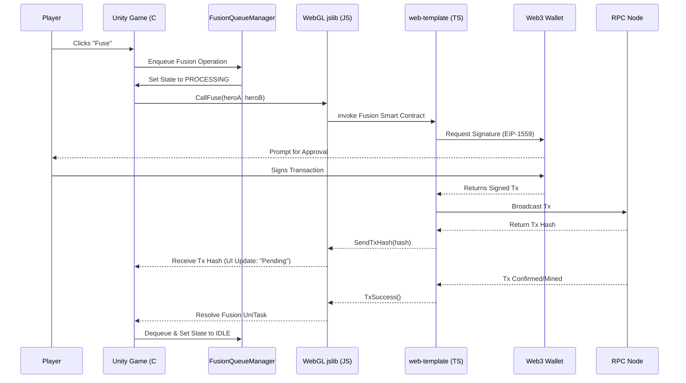

# 🏛 Architecture Manual

Welcome to the Bombcrypto Game Client Architecture Manual. Here we define how the frontend game interacts with the Web3 ecosystem and backend APIs.

## 🗺 System Context (Level 1) & Containers (Level 2)

---

## ⚙️ Core Unity Patterns

### Entity Component System (ECS)
The core logic of the game utilizes a custom **Entity Component System (ECS)** pattern to manage vast numbers of interactive objects (heroes, bombs, blocks) efficiently.

**Location**: `Assets/Scripts/Engine/Entities/`
*Note*: Properties are lazily loaded to minimize `GetComponent` overhead on the hot path.

### WebGL Bridges & Services
Unity communicates with external Web3 components using a **Service/Bridge** pattern.

- `IBlockchainManager`: Defines the interface for blockchain operations (e.g., `UpgradeHero`, `FuseHero`).
- `WebGLBlockchainManager`: Implementations mapped directly to `.jslib` files, which bridge C# calls out to the TypeScript browser environment.
- **Location**: `Assets/Scripts/Services/Blockchain/`

---

## 🔄 Sequence: Example Blockchain Transaction Flow

When a user initiates an action requiring a blockchain transaction (e.g., fusing two heroes):

---

## 📁 Key Directories

| Directory | Description |
|-----------|-------------|
| `Assets/Scripts/Services/` | Core API Managers (`DefaultApiManager`, WebGL Bridges). Includes `Utils.cs` with Data Redaction. |
| `Assets/Scripts/Engine/` | Core Gameplay mechanics and Custom ECS. |
| `Assets/Scripts/Config/` | Configurations and parsers for `AppConfig.json`. |
| `Assets/Editor/Tests/` | PlayMode and EditMode Unity Test files. |
| `unity-web-template/` | Primary TS web application for EVM blockchain interactions (ethers.js v6). |
| `unity-solana-template/` | TS integration for Solana network and wallets. |
| `unity-telegram-template/` | TON specific integration for Telegram mini-apps. |

---

## 🛡 Security Practices

1. **Parameter Sanitization**: All user inputs in URLs (wallets, emails) must be sanitized using `Uri.EscapeDataString()` within Service Managers.
2. **Log Redaction**: Before logging any HTTP/WSS payloads or responses, `Utils.RedactSensitiveData()` is invoked to remove JWTs, private keys, and signatures.
3. **Exact Allowances**: Using "Approve Maximum" is deprecated. Clients implement `ensureAllowance` to approve the exact amount required per transaction.
