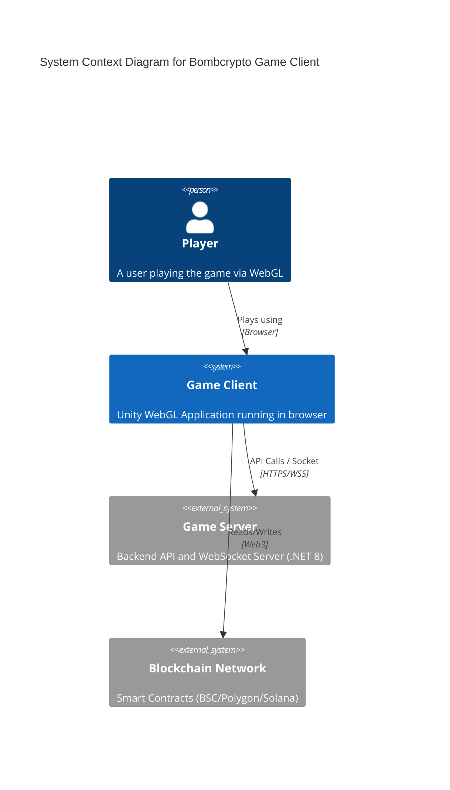

# Bombcrypto Game Client


> The official Unity WebGL client for the Bombcrypto blockchain game.

## 📚 Documentation
- **[System Atlas](SYSTEM_ATLAS.md)**: Full inventory of APIs, components, and data models.
- **[Architecture](ARCHITECTURE.md)**: Diagrams (Sequence, Class, C4) and structure analysis.

## 🏗️ Architecture Overview



## 🚀 Quick Start

### Prerequisites
- Unity 2022.3.x
- `.NET 8` SDK (for backend compatibility checks)

### Setup
Run the following command to initialize the configuration:

```bash
cp Assets/Resources/configs/AppConfig.json.sample Assets/Resources/configs/AppConfig.json
```

## ⚠️ Important Note
This project **cannot operate as a standalone application**. A compatible backend server is required. Most sensitive credentials have been redacted.

---
*Maintained by Senspark*
