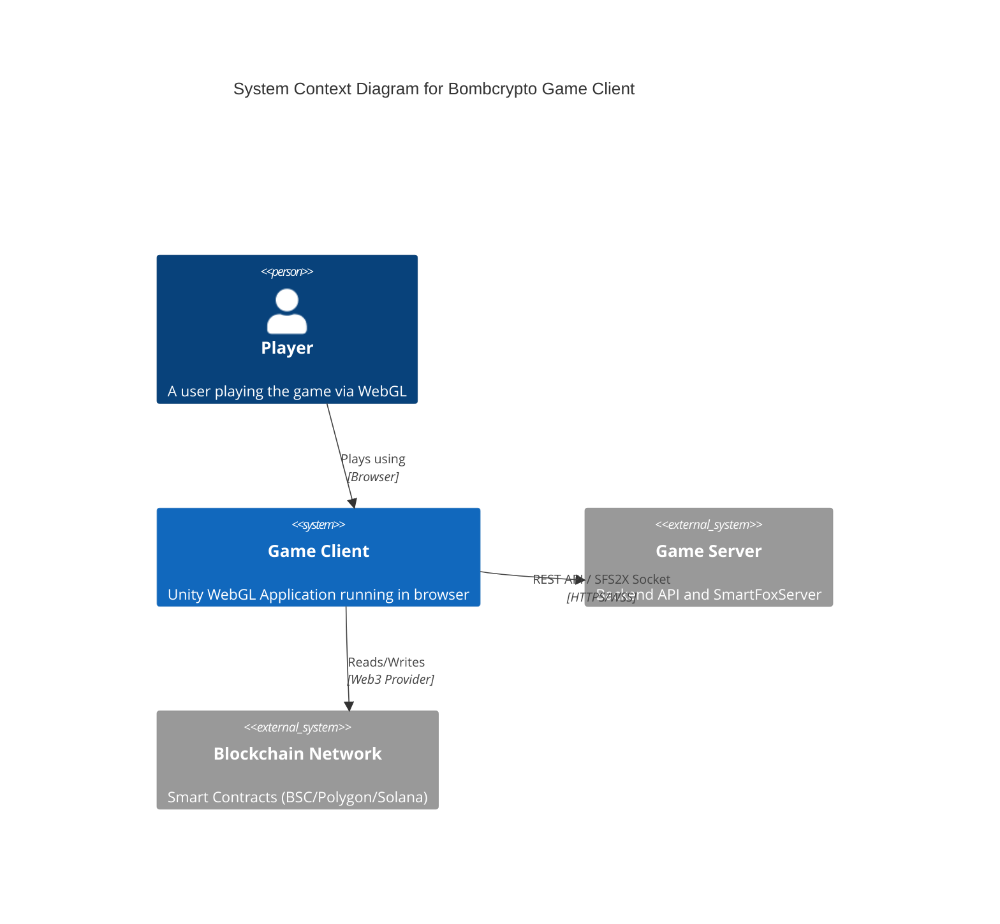

# Bombcrypto Game Client


> The official Unity WebGL client for the Bombcrypto blockchain game.

## 📚 Documentation
- **[System Atlas](SYSTEM_ATLAS.md)**: Full inventory of APIs, components, and data models.
- **[Architecture](ARCHITECTURE.md)**: Diagrams (Sequence, Class, C4) and structure analysis.
- **[Contributor Guide](CONTRIBUTING.md)**: Setup, build instructions, and code standards.

## ❓ Why This Exists
This repository hosts the **Game Client**, a Unity-based WebGL application responsible for the visual and interactive layer of the Bombcrypto ecosystem. It handles:
- **Real-time Gameplay**: Bomber-style logic using a custom ECS (Entity Component System).
- **Blockchain Integration**: Reading wallet balances and signing transactions (via external providers).
- **Server Communication**: Interfacing with the .NET Backend and SmartFoxServer for multiplayer features.

## 🏗️ Architecture Overview



## 🚀 Quick Start

### Prerequisites
- **Unity 2022.3.62f3** (Exact version required).
- A compatible backend server (local or remote).

### Setup
1. **Clone the repository**:
   ```bash
   git clone <repo-url>
   ```

2. **Configure the application**:
   Copy the sample configuration file to the live configuration path.
   ```bash
   cp Assets/Resources/configs/AppConfig.json.sample Assets/Resources/configs/AppConfig.json
   ```

3. **Open in Unity**:
   - Open Unity Hub.
   - Add the project folder.
   - Open the project (ensure target platform is WebGL).

## ⚙️ Configuration
The game is configured via `Assets/Resources/configs/AppConfig.json`. Key fields include:

| Field | Description |
| :--- | :--- |
| `isProduction` | Set to `true` for live environments, `false` for development. |
| `gamePlatform` | Target platform (e.g., `WEBGL`, `MOBILE`). |
| `serverAddresses` | endpoints for API (`baseApiHost`) and Sockets (`svProdTcp`). |
| `encryption` | Salts and keys for secure communication. |

## ⚠️ Important Note
This project **cannot operate as a standalone application**. A compatible backend server is required. Most sensitive credentials have been redacted.

---
*Maintained by Senspark*
