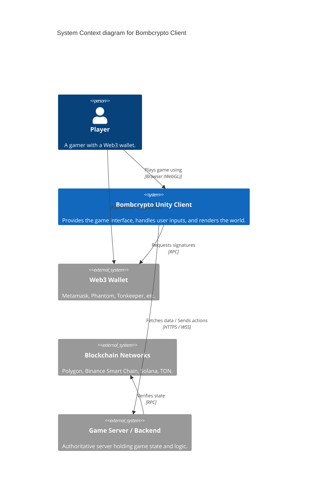

# 💣 Bombcrypto Game Client

> The official open-source game client for the Bombcrypto ecosystem. Build, deploy, and explore the explosive Web3 gaming frontier!

[](https://unity.com/)
[](https://www.gnu.org/licenses/agpl-3.0)
[]()

---

## 🎯 The "Why"

Bombcrypto is an interactive, blockchain-powered gaming experience. This **Game Client** handles the frontend logic, UI, and interactions with various blockchain networks.

This repository is designed to give developers a comprehensive view of how a Unity WebGL client interacts securely with Web3 protocols, smart contracts, and backend APIs.

---

## 🏗 System Architecture (Level 1 Context)



---

## 🚀 Quick Start

### Prerequisites

- **Unity**: `2022.3`
- **Operating System**: macOS (Recommended for full tooling support)
- **Target Platform**: WebGL
- Node.js & npm (for Web3 templates)

### 1. Configuration Setup

The game client requires configuration files to connect to your backend and blockchain environments. These files are excluded from version control to prevent sensitive data leaks.

```bash
# Copy the sample config to create your local AppConfig
cp Assets/Resources/configs/AppConfig.json.sample Assets/Resources/configs/AppConfig.json
```

*Note: Update the `AppConfig.json` with your backend API URLs and necessary credentials.*

### 2. Opening the Project

1. Open Unity Hub.
2. Click **Add** and select the root directory of this repository.
3. Open the project with Unity `2022.3`.

### 3. Web3 Templates (Optional but recommended)

If you are modifying the WebGL bridge or wallet integrations, you will need to build the respective web templates:

```bash
cd unity-web-template
npm install
npm run build-test
```

*(See [ARCHITECTURE.md](ARCHITECTURE.md) for more details on the web templates).*

---

## 📚 Documentation Framework

We adhere to the [Diátaxis](https://diataxis.fr/) documentation framework.

- **[Tutorials](CONTRIBUTING.md)**: How to get started and contribute.
- **[How-To Guides](ARCHITECTURE.md)**: Task-oriented guides (e.g., adding a new blockchain).
- **[Reference](ARCHITECTURE.md)**: System architecture and API details.
- **Explanation**: (See `.scribe/journal.md` for architectural context and gaps).

---

## ⚠️ Important Note

This project **cannot operate as a standalone application**. A compatible backend server is required for the client to function correctly.
